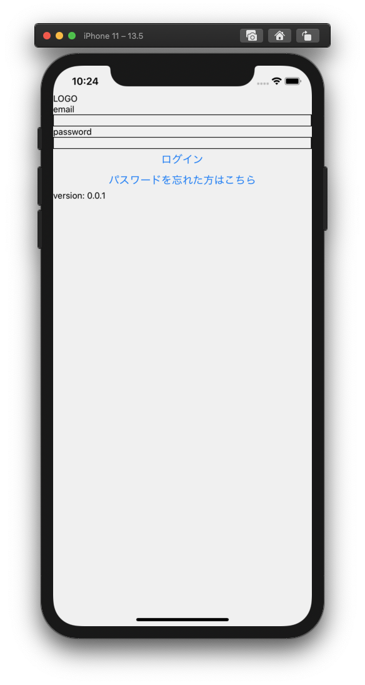

# Hanson お試しの感想

## 前提
- rn-spoilerだとApp.tsxはsrc配下にある、hands-on-202009だとルート配下

## ...v0.1.0

- AppNavigator
  - ReactNavigationの使い方が古かったので最新版(v5)の書き方に変更
- LoginPage
  - iOSで表示するとノッチ部分に「TopPage」が隠れてしまうので大枠のタグをViewからSafeAreaViewに変更
  - navigationはpropsから受け取らずuseNavigationを使うように変更
- Login画面
 - 

## v0.1.0...v0.2.0

- ログイン画面で「v0.1.0」って表示しているのが気になった、 「v0.2.0」の間違い？
- Login画面
  - 

## v0.2.0...v0.3.0

- ログイン画面の「v0.1.0」はそのまま？
- AppNavigator
  - ReactNavigationの使い方が古かったので最新版(v5)の書き方に変更
- PointViewPage
  - iOSで表示するとノッチ部分に「TopPage」が隠れてしまうので大枠のタグをViewからSafeAreaViewに変更
  - navigationはpropsから受け取らずuseNavigationを使うように変更
- Login画面
  - 
- PointView画面
  - 
